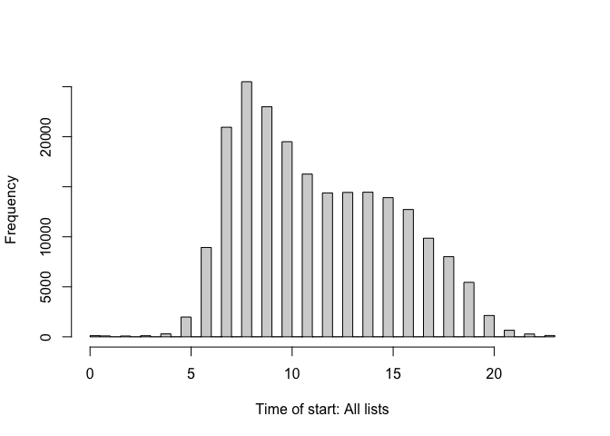
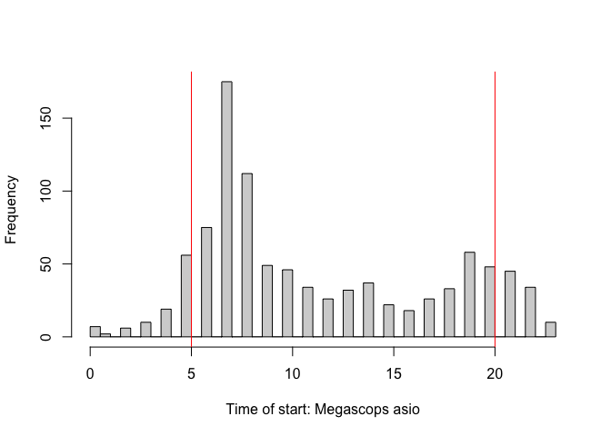
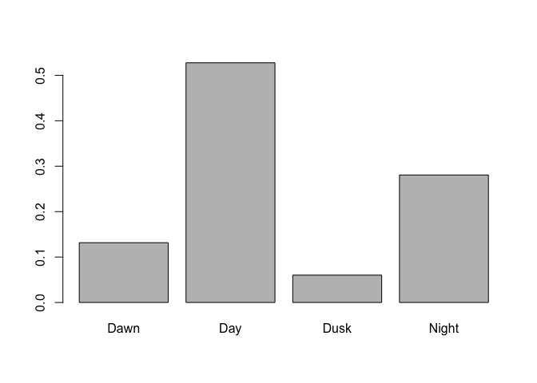
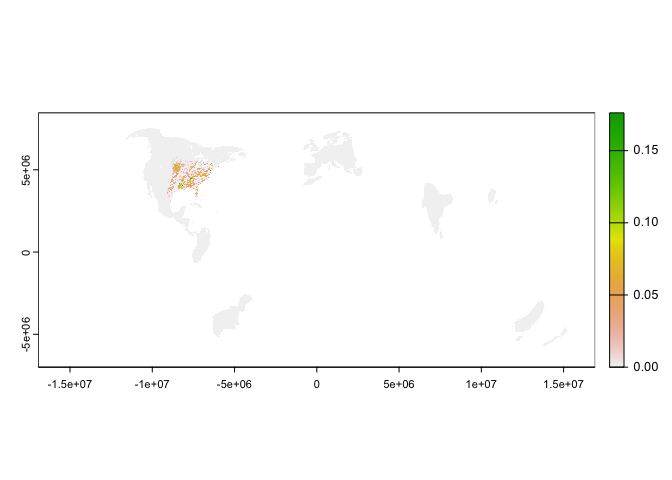
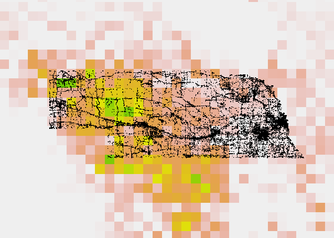
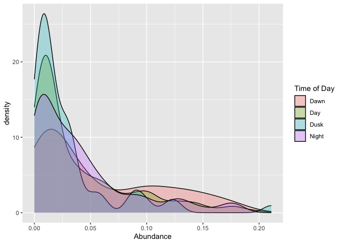
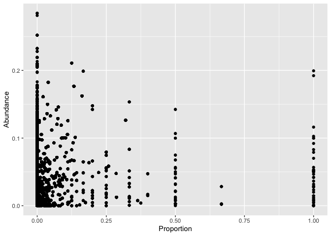
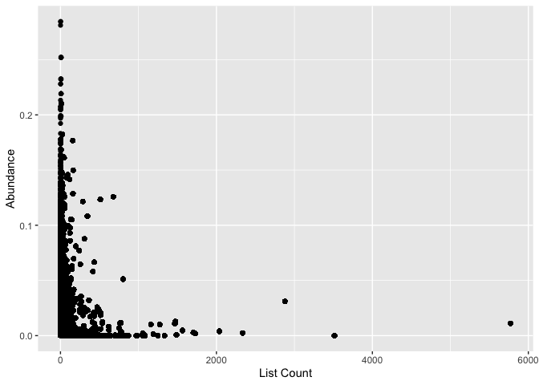

EASO Introduction
================

# Introduction

This is a pipeline for determining the time of day for observations from
the eBird database in relation to sunrise and sunset. This is
specifically important for nocturnal birds, for whom we suspect sampling
errors are resulting in inaccurate models. See Cooper & Soberón 2018 for
more information on how spatially restricted models can result in more
inaccurate models in some situations.

# Data Analysis

## Load Required Packages

*R* uses packages to manage data and add in functionality to the
program. These are the required functions for dealing with eBird data
and for dealing with time and date data.

Note that these packages must be installed the first time using
`install.packages()`, with the name of the package in quotes.

**Note** that I also create a `filepath` variable here. This variable
declares the *working directory* where the files are accessible from the
computer you are working on. These files are saved into OneDrive, and
this format shows how to access them from Mac.

``` r
filepath <- "~/OneDrive - University of Nebraska at Kearney/Research/Eastern Screech-Owls/"

library(tidyverse)
```

    ## ── Attaching core tidyverse packages ──────────────────────── tidyverse 2.0.0 ──
    ## ✔ dplyr     1.1.3     ✔ readr     2.1.4
    ## ✔ forcats   1.0.0     ✔ stringr   1.5.0
    ## ✔ ggplot2   3.4.4     ✔ tibble    3.2.1
    ## ✔ lubridate 1.9.3     ✔ tidyr     1.3.0
    ## ✔ purrr     1.0.2     
    ## ── Conflicts ────────────────────────────────────────── tidyverse_conflicts() ──
    ## ✖ dplyr::filter() masks stats::filter()
    ## ✖ dplyr::lag()    masks stats::lag()
    ## ℹ Use the conflicted package (<http://conflicted.r-lib.org/>) to force all conflicts to become errors

``` r
library(terra)
```

    ## terra 1.7.46
    ## 
    ## Attaching package: 'terra'
    ## 
    ## The following object is masked from 'package:tidyr':
    ## 
    ##     extract

``` r
library(auk)
```

    ## auk 0.6.0 is designed for EBD files downloaded after 2022-10-25. 
    ## EBD data directory:  /Users/cooperj2/Library/CloudStorage/OneDrive-UniversityofNebraskaatKearney/Research/Resurvey/Kansas Resurvey/ebd_US-KS_202108_202312_smp_relNov-2023 
    ## eBird taxonomy version:  2022

``` r
library(lutz)
library(suncalc)

# load time function
source(paste0(filepath,"ebird_time_data.R"))
```

For each species, we need to create a “zero-filled” file. We extract the
data for the species of interest from the dataset, and then we add in
the sampling data to find the areas where the species was not detected.
This will also give us an idea of when and where the species was not
detected, to give us an idea of overall sampling in different abundance
areas. This part will be the same for each species except for the
`species` field.

eBird data for modeling are also filtered to get the higher-quality data
for modeling. This removes a lot of incidental observations etc.

``` r
ebd <- auk_ebd(paste0(filepath,
                      "ebd_US-NE_smp_relAug-2023/ebd_US-NE_smp_relAug-2023.txt"), 
               file_sampling = paste0(filepath,
                                      "ebd_US-NE_smp_relAug-2023/ebd_US-NE_smp_relAug-2023_sampling.txt"))

# filter data
# declare filters here
ebd_filters <- ebd %>%
  # define species here
  # English or Scientific Name
  auk_species("Megascops asio") %>% 
  # restrict to the standard traveling and stationary count protocols
  auk_protocol(protocol = c("Stationary", "Traveling")) %>% 
  # restrict to complete checklists
  auk_complete()

# rename files for each species
# here, "easo" for Eastern Screech-Owl
f_ebd <- file.path(filepath, "ebd_easo_ne.txt")
f_sampling <- file.path(filepath, "ebd_easo_ne_sample.txt")

# only run if the files don't already exist
if (!file.exists(f_ebd)) {
  auk_filter(ebd_filters, file = f_ebd, file_sampling = f_sampling,
             overwrite = T)
}

# observed and not observed
# set to more recent years
zerofill_file <- auk_zerofill(f_ebd, f_sampling, collapse = TRUE) %>% 
  mutate(
    # convert X to NA
    observation_count = if_else(observation_count == "X", 
                                NA_character_, observation_count),
    observation_count = as.integer(observation_count),
    # effort_distance_km to 0 for non-travelling counts
    effort_distance_km = if_else(protocol_type != "Traveling", 
                                 0, effort_distance_km),
    # convert time to decimal hours since midnight
    # kept here - needed for modeling
    # time_observations_started = time_to_decimal(time_observations_started),
    # split date into year and day of year
    # we keep date different - kept here for notes
    # year = year(observation_date),
    # day_of_year = yday(observation_date)
  ) %>%
  filter(year(observation_date) >= 2000,
         year(observation_date) <= 2023) %>%
  # remove na from duration; some exist!
  drop_na(duration_minutes) %>% drop_na(time_observations_started) %>%
  drop_na(observation_count)

ebd_zerofill_times <- ebd_time_data(zerofill_file)

write_rds(ebd_zerofill_times,file=paste0(filepath,"Megascops_asio.rds"))
```

``` r
observations <- read_rds(paste0(filepath,"Megascops_asio.rds"))
```

``` r
observations$time_observations_started <- 
  as.POSIXct(observations$time_observations_started, 
             format = "%H:%M:%S")


hist(hour(as.POSIXct(observations$time_observations_started,
                     format = "%H:%M:%S")),
     breaks=48,
     xlab="Time of start: All lists",main="")
```

<!-- -->

``` r
hist(
  hour(
    as.POSIXct(observations$time_observations_started,
                     format = "%H:%M:%S")[
      which(observations$species_observed==T)]),
  breaks=48,
  xlab=paste0("Time of start: ",
              observations$scientific_name[1]),
  main="")

abline(v=5,col="red")
abline(v=20,col="red")
```

<!-- -->

``` r
summary(observations$Time_of_Day)/nrow(observations)
```

    ##       Dawn        Day       Dusk      Night 
    ## 0.02824067 0.92613727 0.02221086 0.02341120

What about for just the records with our bird?

``` r
easo <- observations %>%
  filter(species_observed==T)

summary(easo$Time_of_Day)/nrow(easo)
```

    ##       Dawn        Day       Dusk      Night 
    ## 0.13163265 0.52755102 0.06020408 0.28061224

Dawn = 13.1%, Diurnal = 52.9%, Dusk = 6.1%, Nocturnal = 27.9%.

``` r
barplot(prop.table(table(easo$Time_of_Day)))
```

<!-- -->

``` r
# let's look at abundance

abundance <- rast(paste0(filepath,"abundances/easowl1_abundance_seasonal_year_round_mean_2021.tif"))

plot(abundance)
```

<!-- -->

``` r
# convert to same coordinate system
abundance <- abundance %>% project("epsg:4326")
```

    ## |---------|---------|---------|---------|=========================================                                          

``` r
plot(observations$longitude,observations$latitude,asp=1,pch=".")
plot(abundance,add=T)
points(observations$longitude,observations$latitude,asp=1,pch=".")
```

<!-- -->

``` r
occ <- observations[,c("longitude","latitude")]

vals <- extract(abundance,occ,cells = T) %>%
  cbind(observations$Time_of_Day,
        observations$species_observed) %>%
  rename('abundance' = 'resident',
         'time_of_day' = 'observations$Time_of_Day',
         'species_observed' = 'observations$species_observed')
```

``` r
a <- ggplot(vals[which(vals$species_observed==T),],aes(x=abundance,fill=time_of_day))
b <- geom_density(alpha = 0.3)
c <- labs(x = "Abundance",fill = "Time of Day")

a+b+c
```

<!-- -->

We are looking for “high detectability = low survey effort”.
Specifically, we want to look at abundance related to the % checklists
with owls from each site.

``` r
cell_nobird <- vals %>% count(cell) %>%
  rename("nobird" = "n")
cell_bird <- vals[which(vals$species_observed==T),] %>% count(cell) %>%
  rename("bird" = "n")

cell_count <- cell_nobird %>% left_join(cell_bird,by = "cell")

cell_count$bird[which(is.na(cell_count$bird))] <- 0

cell_count$proportion <- cell_count$bird/cell_count$nobird

vals <- vals %>%
  left_join(cell_count,by = "cell")

ggplot(vals,aes(x=proportion,y=abundance)) + 
  geom_point() +
  labs(x = "Proportion",y = "Abundance")
```

<!-- -->

``` r
ggplot(vals,aes(x=nobird,y=abundance)) + 
  geom_point() +
  labs(x = "List Count",y = "Abundance")
```

<!-- -->
