Cooper Demonstration
================

# Introduction

This is a pipeline for determining the time of day for observations from
the eBird database in relation to sunrise and sunset. This is
specifically important for nocturnal birds, for whom we suspect sampling
errors are resulting in inaccurate models. See Cooper & Soberón 2018 for
more information on how spatially restricted models can result in more
inaccurate models in some situations.

# Data Analysis

## Load Required Packages

*R* uses packages to manage data and add in functionality to the
program. These are the required functions for dealing with eBird data
and for dealing with time and date data.

Note that these packages must be installed the first time using
`install.packages()`, with the name of the package in quotes.

**Note** that I also create a `filepath` variable here. This variable
declares the *working directory* where the files are accessible from the
computer you are working on. These files are saved into OneDrive, and
this format shows how to access them from Mac.

``` r
filepath <- "~/OneDrive - University of Nebraska at Kearney/Research/Eastern Screech-Owls/"

library(tidyverse)
```

    ## ── Attaching core tidyverse packages ──────────────────────── tidyverse 2.0.0 ──
    ## ✔ dplyr     1.1.3     ✔ readr     2.1.4
    ## ✔ forcats   1.0.0     ✔ stringr   1.5.0
    ## ✔ ggplot2   3.4.4     ✔ tibble    3.2.1
    ## ✔ lubridate 1.9.3     ✔ tidyr     1.3.0
    ## ✔ purrr     1.0.2     
    ## ── Conflicts ────────────────────────────────────────── tidyverse_conflicts() ──
    ## ✖ dplyr::filter() masks stats::filter()
    ## ✖ dplyr::lag()    masks stats::lag()
    ## ℹ Use the conflicted package (<http://conflicted.r-lib.org/>) to force all conflicts to become errors

``` r
library(terra)
```

    ## terra 1.7.46
    ## 
    ## Attaching package: 'terra'
    ## 
    ## The following object is masked from 'package:tidyr':
    ## 
    ##     extract

``` r
library(auk)
```

    ## auk 0.6.0 is designed for EBD files downloaded after 2022-10-25. 
    ## EBD data directory:  /Users/cooperj2/Library/CloudStorage/OneDrive-UniversityofNebraskaatKearney/Research/Resurvey/Kansas Resurvey/ebd_US-KS_202108_202312_smp_relNov-2023 
    ## eBird taxonomy version:  2022

``` r
library(lutz)
library(suncalc)

# load time function
source(paste0(filepath,"ebird_time_data.R"))
source(paste0(filepath,"ebd_subsetter.R"))
source(paste0(filepath,"abundance_extractor.R"))
```

For each species, we need to create a “zero-filled” file. We extract the
data for the species of interest from the dataset, and then we add in
the sampling data to find the areas where the species was not detected.
This will also give us an idea of when and where the species was not
detected, to give us an idea of overall sampling in different abundance
areas. This part will be the same for each species except for the
`species` field.

eBird data for modeling are also filtered to get the higher-quality data
for modeling. This removes a lot of incidental observations etc.

``` r
bird_file <- "ebd_US-NE_smp_relAug-2023/ebd_US-NE_smp_relAug-2023.txt"
sample_file <- "ebd_US-NE_smp_relAug-2023/ebd_US-NE_smp_relAug-2023_sampling.txt"
species <- "Buteo jamaicensis" # can be multiple
filename <- "Buteo_jamaicensis"
```

``` r
ebd_subsetter(bird_file = bird_file,sample_file = sample_file,
              species = species,
              filename = filename,filepath = filepath)

# change for each species

species <- "Megascops asio" # can be multiple
filename <- "Megascops_asio"

ebd_subsetter(bird_file = bird_file,sample_file = sample_file,
              species = species,
              filename = filename,filepath = filepath)

species <- "Strix varia" # can be multiple
filename <- "Strix_varia"

ebd_subsetter(bird_file = bird_file,sample_file = sample_file,
              species = species,
              filename = filename,filepath = filepath)

species <- "Buteo jamaicensis" # can be multiple
filename <- "Buteo_jamaicensis"

ebd_subsetter(bird_file = bird_file,sample_file = sample_file,
              species = species,
              filename = filename,filepath = filepath)

species <- "Accipiter cooperii" # can be multiple
filename <- "Accipiter_cooperii"

ebd_subsetter(bird_file = bird_file,sample_file = sample_file,
              species = species,
              filename = filename,filepath = filepath)

species <- "Passer domesticus" # can be multiple
filename <- "Passer_domesticus"

ebd_subsetter(bird_file = bird_file,sample_file = sample_file,
              species = species,
              filename = filename,filepath = filepath)

species <- "Chaetura pelagica" # can be multiple
filename <- "Chaetura_pelagica"

ebd_subsetter(bird_file = bird_file,sample_file = sample_file,
              species = species,
              filename = filename,filepath = filepath)

species <- "Antrostomus vociferus" # can be multiple
filename <- "Antrostomus_vociferus"

ebd_subsetter(bird_file = bird_file,sample_file = sample_file,
              species = species,
              filename = filename,filepath = filepath)

species <- "Antrostomus carolinensis" # can be multiple
filename <- "Antrostomus_carolinensis"

ebd_subsetter(bird_file = bird_file,sample_file = sample_file,
              species = species,
              filename = filename,filepath = filepath)


list.files(filepath,pattern=".rds")
```

``` r
# abundance extractor for each species

rdspath <- paste0(filepath,"rds/")
abundancepath <- paste0(filepath,"abundances/")

abundance_extracter(paste0(rdspath,"Megascops_asio.rds"),
                    paste0(abundancepath,"easowl1_abundance_seasonal_year_round_mean_2021.tif"),
                    "Megascops_asio")

abundance_extracter(paste0(rdspath,"Strix_varia.rds"),
                    paste0(abundancepath,"brdowl_abundance_seasonal_year_round_mean_2021.tif"),
                    "Strix_varia")

abundance_extracter(paste0(rdspath,"Buteo_jamaicensis.rds"),
                    paste0(abundancepath,"rethaw_abundance_seasonal_full-year_mean_2021.tif"),
                    "Buteo_jamaicensis")

abundance_extracter(paste0(rdspath,"Accipiter_cooperii.rds"),
                    paste0(abundancepath,"coohaw_abundance_seasonal_full-year_mean_2021.tif"),
                    "Accipiter_cooperii")

abundance_extracter(paste0(rdspath,"Passer_domesticus.rds"),
                    paste0(abundancepath,"houspa_abundance_seasonal_year_round_mean_2021.tif"),
                    "Passer_domesticus")

abundance_extracter(paste0(rdspath,"Chaetura_pelagica.rds"),
                    paste0(abundancepath,"chiswi_abundance_seasonal_full-year_mean_2021.tif"),
                    "Chaetura_pelagica")

abundance_extracter(paste0(filepath,"rds/Antrostomus_carolinensis.rds"),
                    paste0(filepath,
                           "abundances/easwpw1_abundance_seasonal_breeding_mean_2022.tif"),
                    "Antrostomus_carolinensis")

abundance_extracter(paste0(filepath,"rds/Antrostomus_vociferus.rds"),
                    paste0(abundancepath,"chwwid_abundance_seasonal_breeding_mean_2022.tif"),
                    "Antrostomus_vociferus")
```

``` r
mega <- read_rds(paste0(filepath,"Megascops_asio_abundance_data.rds"))%>%
  filter(species_observed==T)

strx <- read_rds(paste0(filepath,"Strix_varia_abundance_data.rds"))%>%
  filter(species_observed==T)

bute <- read_rds(paste0(filepath,"Buteo_jamaicensis_abundance_data.rds"))%>%
  filter(species_observed==T)

acci <- read_rds(paste0(filepath,"Accipiter_cooperii_abundance_data.rds"))%>%
  filter(species_observed==T)

pass <- read_rds(paste0(filepath,"Passer_domesticus_abundance_data.rds"))%>%
  filter(species_observed==T)

chae <- read_rds(paste0(filepath,"Chaetura_pelagica_abundance_data.rds"))%>%
  filter(species_observed==T)

voci <- read_rds(paste0(filepath,"Antrostomus_vociferus_abundance_data.rds"))%>%
  filter(species_observed==T)

caro <- read_rds(paste0(filepath,"Antrostomus_carolinensis_abundance_data.rds"))%>%
  filter(species_observed==T)
```

``` r
mega <- mega %>%
  mutate(rel_abun = abundance/max(abundance))
strx <- strx %>%
  mutate(rel_abun = abundance/max(abundance))
bute <- bute %>%
  mutate(rel_abun = abundance/max(abundance))
acci <- acci %>%
  mutate(rel_abun = abundance/max(abundance))
pass <- pass %>%
  mutate(rel_abun = abundance/max(abundance))
chae <- chae %>%
  mutate(rel_abun = abundance/max(abundance))
voci <- voci %>%
  mutate(rel_abun = abundance/max(abundance))
caro <- caro %>%
  mutate(rel_abun = abundance/max(abundance))
```

``` r
index1 <- caro[caro$time_of_day=="Night"&caro$abundance>0,]

hist(index1$rel_abun,breaks=50,main = "Antrostomus carolinensis, Night",xlab = "Abundance")
```

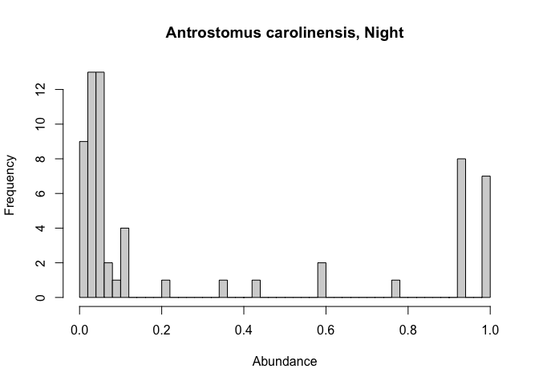<!-- -->

``` r
index <- voci[voci$time_of_day=="Night"&voci$abundance>0,]
hist(index$rel_abun,breaks=50,main = "Antrostomus vociferus, Night",xlab = "Abundance")
```

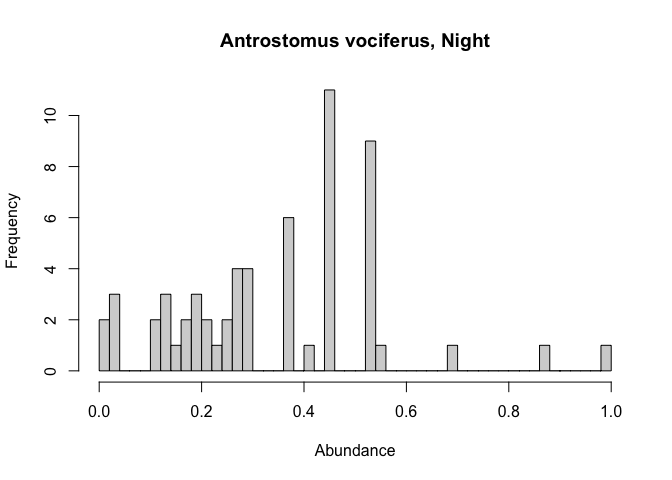<!-- -->

``` r
# pull random, equal sizes samples from distributions
# do with and without 0 points, to show variation and bias
# KS tests of difference

pass_abun <- pass$rel_abun
chae_abun <- chae$rel_abun
mega_abun <- mega$rel_abun
bute_abun <- bute$rel_abun
acci_abun <- acci$rel_abun
strx_abun <- strx$rel_abun
voci_abun <- voci$rel_abun
caro_abun <- caro$rel_abun

# all of these populatons can be tested with mann-whitney U

# function to get aggregate P values from subsetting

a <- mega_abun
b <- bute_abun

sp.a <- 'Megascops'
sp.b <- 'Buteo'

# larger value always assigned A

mann_whitney_compare <- function(sp.a,sp.b,a,b,side=NULL){
  if(is.null(side)==T){side <- "two.sided"}
  n_a <- length(a)
  n_b <- length(b)
  if(n_a > n_b){
    print("A is larger.")
    sp_a <- sp.a
    sp_b <- sp.b
    x_a <- a
    x_b <- b
  }
  if(n_a < n_b){
    print("B is larger.")
    sp_a <- sp.b
    sp_b <- sp.a
    x_a <- b
    x_b <- a
  }
  if(n_a == n_b){
    print("Equal sample sizes.")
    sp_a <- sp.a
    sp_b <- sp.b
    x_a <- a
    x_b <- b
  }
  
  sample_p <- NULL
  p_mat <- NULL
  
  print("Performing non-parametric comparison: large samples.")
  print(paste0("Conf. Level 0.95. Test is for ",side))
  print(paste0("Median for ",
         sp_a," is ",round(median(x_a),digits = 4)))
  print(paste0("Median for ",
         sp_b," is ",round(median(x_b),digits = 4)))
  # progress bar
  pb = txtProgressBar(min = 0, max = length(1000), initial = 0) 
  for(i in 1:1000){
    setTxtProgressBar(pb,i)
    sample_p <- sample(x_a,n_b)
    p <- wilcox.test(sample_p,x_b,
                alternative = side)
    p_mat[i] <- p$p.value
    close(pb)
  }
  print("Complete.")
  print(paste0("Difference has a p value of ",mean(p_mat)))
  print(paste0("P value has stdev of ",sd(p_mat)))
  breaks <- seq(0,1,by=0.01)
  hist(p_mat,breaks = breaks,
       main = paste0("Histogram of p-vals: ",sp_a," vs ",sp_b),
       xlab = paste0("p values: ",side))
  
  print("Performing non-parametric comparison: small, equal sample sizes.")
  print(paste0("Conf. Level 0.95. Test is for ",side))
  print(paste0("Mean for ",
         sp_a," is ",round(mean(x_a),digits = 4)))
  print(paste0("Mean for ",
         sp_b," is ",round(mean(x_b),digits = 4)))
  # progress bar
  print("Sampling 200 samples. If too small, skipped.")
  pb = txtProgressBar(min = 0, max = length(1000), initial = 0) 
  for(i in 1:1000){
    if(n_b<200){
      print("Too few points.")
      break
    }
    setTxtProgressBar(pb,i)
    sample_a <- sample(x_a,200)
    sample_b <- sample(x_b,200)
    p <- wilcox.test(sample_p,sample_b,
                alternative = side)
    p_mat[i] <- p$p.value
    close(pb)
  }
  if(n_b>=200){
    print("Complete.")
    print(
      paste0("Difference of subsamples has a p value of ",
             mean(p_mat)))
    print(paste0("P value has stdev of ",sd(p_mat)))
    breaks <- seq(0,1,by=0.01)
    hist(p_mat,breaks = breaks,
         main = paste0("Histogram of subsampled p-vals: ",
                       sp_a," vs ",sp_b),
         xlab = paste0("p values: ",side))
  }
}
```

``` r
mann_whitney_compare(sp.a = "Passer",sp.b = "Chaetura",
                     a = pass_abun,b = chae_abun)
```

    ## [1] "A is larger."
    ## [1] "Performing non-parametric comparison: large samples."
    ## [1] "Conf. Level 0.95. Test is for two.sided"
    ## [1] "Median for Passer is 0.1337"
    ## [1] "Median for Chaetura is 0.1494"
    ## ================================================================================
    ## [1] "Complete."
    ## [1] "Difference has a p value of 0.469866903258811"
    ## [1] "P value has stdev of 0.247575623268992"

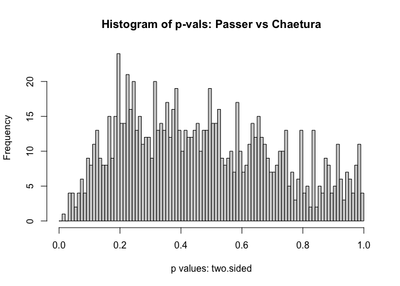<!-- -->

    ## [1] "Performing non-parametric comparison: small, equal sample sizes."
    ## [1] "Conf. Level 0.95. Test is for two.sided"
    ## [1] "Mean for Passer is 0.1835"
    ## [1] "Mean for Chaetura is 0.2058"
    ## [1] "Sampling 200 samples. If too small, skipped."
    ## ================================================================================
    ## [1] "Complete."
    ## [1] "Difference of subsamples has a p value of 0.439156753227064"
    ## [1] "P value has stdev of 0.305605750663128"

<!-- -->

``` r
mann_whitney_compare(sp.a = "Accipiter",sp.b = "Strix",
                     a = acci_abun,b = strx_abun)
```

    ## [1] "A is larger."
    ## [1] "Performing non-parametric comparison: large samples."
    ## [1] "Conf. Level 0.95. Test is for two.sided"
    ## [1] "Median for Accipiter is 0.337"
    ## [1] "Median for Strix is 0.2083"
    ## ================================================================================
    ## [1] "Complete."
    ## [1] "Difference has a p value of 1.86955947941874e-126"
    ## [1] "P value has stdev of 5.66702782156415e-125"

<!-- -->

    ## [1] "Performing non-parametric comparison: small, equal sample sizes."
    ## [1] "Conf. Level 0.95. Test is for two.sided"
    ## [1] "Mean for Accipiter is 0.3666"
    ## [1] "Mean for Strix is 0.2264"
    ## [1] "Sampling 200 samples. If too small, skipped."
    ## ================================================================================
    ## [1] "Complete."
    ## [1] "Difference of subsamples has a p value of 6.94107192534811e-12"
    ## [1] "P value has stdev of 1.27635848140949e-10"

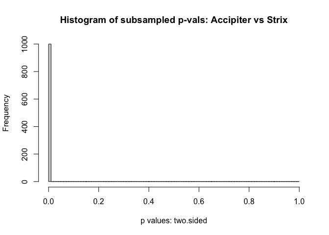<!-- -->

``` r
mann_whitney_compare(sp.a = "Passer",sp.b = "Megascops",
                     a = pass_abun,b = mega_abun)
```

    ## [1] "A is larger."
    ## [1] "Performing non-parametric comparison: large samples."
    ## [1] "Conf. Level 0.95. Test is for two.sided"
    ## [1] "Median for Passer is 0.1337"
    ## [1] "Median for Megascops is 0.1027"
    ## ================================================================================
    ## [1] "Complete."
    ## [1] "Difference has a p value of 1.93959154117928e-05"
    ## [1] "P value has stdev of 0.000142665016753944"

<!-- -->

    ## [1] "Performing non-parametric comparison: small, equal sample sizes."
    ## [1] "Conf. Level 0.95. Test is for two.sided"
    ## [1] "Mean for Passer is 0.1835"
    ## [1] "Mean for Megascops is 0.1948"
    ## [1] "Sampling 200 samples. If too small, skipped."
    ## ================================================================================
    ## [1] "Complete."
    ## [1] "Difference of subsamples has a p value of 0.0071653975822343"
    ## [1] "P value has stdev of 0.0316791501168487"

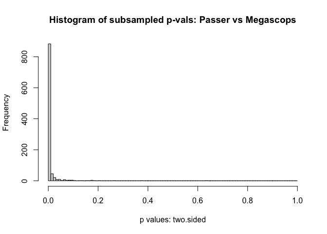<!-- -->

``` r
mann_whitney_compare(sp.a = "Passer",sp.b = "Buteo",
                     a = pass_abun,b = bute_abun)
```

    ## [1] "A is larger."
    ## [1] "Performing non-parametric comparison: large samples."
    ## [1] "Conf. Level 0.95. Test is for two.sided"
    ## [1] "Median for Passer is 0.1337"
    ## [1] "Median for Buteo is 0.422"
    ## ================================================================================
    ## [1] "Complete."
    ## [1] "Difference has a p value of 0"
    ## [1] "P value has stdev of 0"

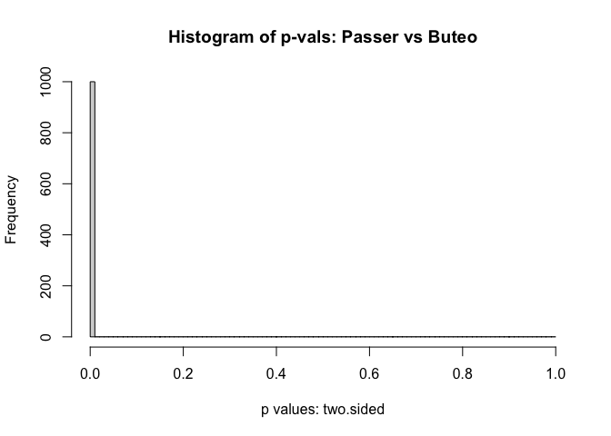<!-- -->

    ## [1] "Performing non-parametric comparison: small, equal sample sizes."
    ## [1] "Conf. Level 0.95. Test is for two.sided"
    ## [1] "Mean for Passer is 0.1835"
    ## [1] "Mean for Buteo is 0.4225"
    ## [1] "Sampling 200 samples. If too small, skipped."
    ## ================================================================================
    ## [1] "Complete."
    ## [1] "Difference of subsamples has a p value of 3.7199925856198e-69"
    ## [1] "P value has stdev of 1.027323045318e-67"

<!-- -->

``` r
mann_whitney_compare(sp.a = "Passer",sp.b = "Accipiter",
                     a = pass_abun,b = acci_abun)
```

    ## [1] "A is larger."
    ## [1] "Performing non-parametric comparison: large samples."
    ## [1] "Conf. Level 0.95. Test is for two.sided"
    ## [1] "Median for Passer is 0.1337"
    ## [1] "Median for Accipiter is 0.337"
    ## ================================================================================
    ## [1] "Complete."
    ## [1] "Difference has a p value of 0"
    ## [1] "P value has stdev of 0"

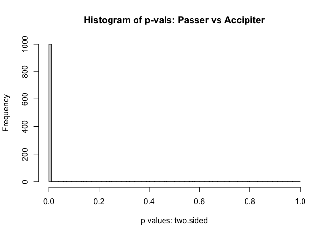<!-- -->

    ## [1] "Performing non-parametric comparison: small, equal sample sizes."
    ## [1] "Conf. Level 0.95. Test is for two.sided"
    ## [1] "Mean for Passer is 0.1835"
    ## [1] "Mean for Accipiter is 0.3666"
    ## [1] "Sampling 200 samples. If too small, skipped."
    ## ================================================================================
    ## [1] "Complete."
    ## [1] "Difference of subsamples has a p value of 1.84244483773369e-26"
    ## [1] "P value has stdev of 3.19526436520964e-25"

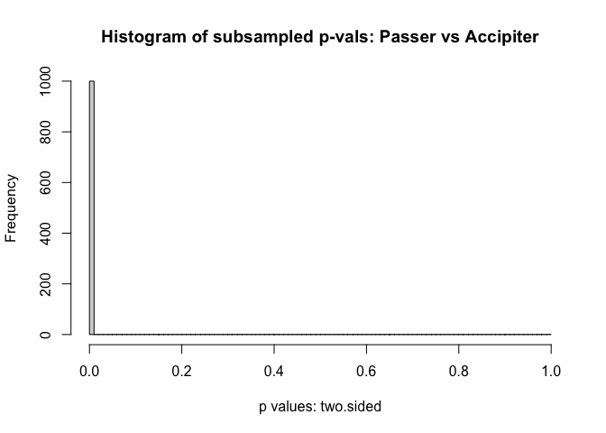<!-- -->

``` r
mann_whitney_compare(sp.a = "Passer",sp.b = "Strix",
                     a = pass_abun,b = strx_abun)
```

    ## [1] "A is larger."
    ## [1] "Performing non-parametric comparison: large samples."
    ## [1] "Conf. Level 0.95. Test is for two.sided"
    ## [1] "Median for Passer is 0.1337"
    ## [1] "Median for Strix is 0.2083"
    ## ================================================================================
    ## [1] "Complete."
    ## [1] "Difference has a p value of 2.1420566121185e-11"
    ## [1] "P value has stdev of 5.48453024249454e-10"

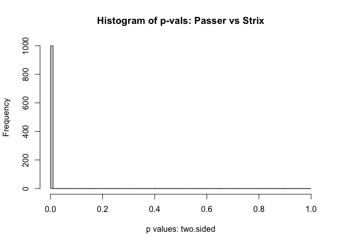<!-- -->

    ## [1] "Performing non-parametric comparison: small, equal sample sizes."
    ## [1] "Conf. Level 0.95. Test is for two.sided"
    ## [1] "Mean for Passer is 0.1835"
    ## [1] "Mean for Strix is 0.2264"
    ## [1] "Sampling 200 samples. If too small, skipped."
    ## ================================================================================
    ## [1] "Complete."
    ## [1] "Difference of subsamples has a p value of 0.0728706364041129"
    ## [1] "P value has stdev of 0.14226039711842"

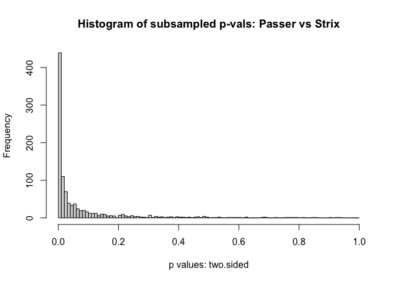<!-- -->

``` r
mann_whitney_compare(sp.a = "Chaetura",sp.b = "Megascops",
                     a = chae_abun,b = mega_abun)
```

    ## [1] "A is larger."
    ## [1] "Performing non-parametric comparison: large samples."
    ## [1] "Conf. Level 0.95. Test is for two.sided"
    ## [1] "Median for Chaetura is 0.1494"
    ## [1] "Median for Megascops is 0.1027"
    ## ================================================================================
    ## [1] "Complete."
    ## [1] "Difference has a p value of 0.0630642169933152"
    ## [1] "P value has stdev of 0.109312520162718"

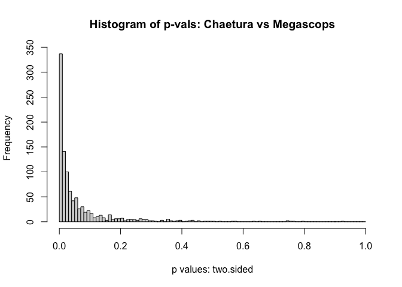<!-- -->

    ## [1] "Performing non-parametric comparison: small, equal sample sizes."
    ## [1] "Conf. Level 0.95. Test is for two.sided"
    ## [1] "Mean for Chaetura is 0.2058"
    ## [1] "Mean for Megascops is 0.1948"
    ## [1] "Sampling 200 samples. If too small, skipped."
    ## ================================================================================
    ## [1] "Complete."
    ## [1] "Difference of subsamples has a p value of 0.27431681336718"
    ## [1] "P value has stdev of 0.266985670204558"

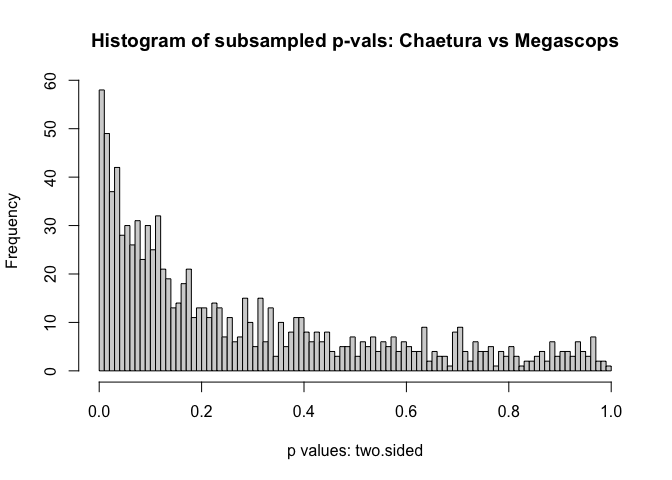<!-- -->

``` r
mann_whitney_compare(sp.a = "Chaetura",sp.b = "Buteo",
                     a = chae_abun,b = bute_abun)
```

    ## [1] "B is larger."
    ## [1] "Performing non-parametric comparison: large samples."
    ## [1] "Conf. Level 0.95. Test is for two.sided"
    ## [1] "Median for Buteo is 0.422"
    ## [1] "Median for Chaetura is 0.1494"
    ## ================================================================================
    ## [1] "Complete."
    ## [1] "Difference has a p value of 0"
    ## [1] "P value has stdev of 0"

<!-- -->

    ## [1] "Performing non-parametric comparison: small, equal sample sizes."
    ## [1] "Conf. Level 0.95. Test is for two.sided"
    ## [1] "Mean for Buteo is 0.4225"
    ## [1] "Mean for Chaetura is 0.2058"
    ## [1] "Sampling 200 samples. If too small, skipped."
    ## ================================================================================
    ## [1] "Complete."
    ## [1] "Difference of subsamples has a p value of 5.7261811510539e-34"
    ## [1] "P value has stdev of 1.28293825312306e-32"

<!-- -->

``` r
mann_whitney_compare(sp.a = "Chaetura",sp.b = "Accipiter",
                     a = chae_abun,b = acci_abun)
```

    ## [1] "A is larger."
    ## [1] "Performing non-parametric comparison: large samples."
    ## [1] "Conf. Level 0.95. Test is for two.sided"
    ## [1] "Median for Chaetura is 0.1494"
    ## [1] "Median for Accipiter is 0.337"
    ## ================================================================================
    ## [1] "Complete."
    ## [1] "Difference has a p value of 0"
    ## [1] "P value has stdev of 0"

<!-- -->

    ## [1] "Performing non-parametric comparison: small, equal sample sizes."
    ## [1] "Conf. Level 0.95. Test is for two.sided"
    ## [1] "Mean for Chaetura is 0.2058"
    ## [1] "Mean for Accipiter is 0.3666"
    ## [1] "Sampling 200 samples. If too small, skipped."
    ## ================================================================================
    ## [1] "Complete."
    ## [1] "Difference of subsamples has a p value of 4.56147657006041e-19"
    ## [1] "P value has stdev of 1.17932046514765e-17"

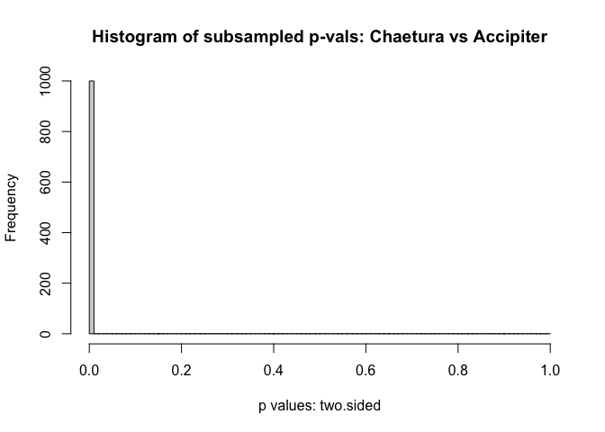<!-- -->

``` r
mann_whitney_compare(sp.a = "Chaetura",sp.b = "Strix",
                     a = chae_abun,b = strx_abun)
```

    ## [1] "A is larger."
    ## [1] "Performing non-parametric comparison: large samples."
    ## [1] "Conf. Level 0.95. Test is for two.sided"
    ## [1] "Median for Chaetura is 0.1494"
    ## [1] "Median for Strix is 0.2083"
    ## ================================================================================
    ## [1] "Complete."
    ## [1] "Difference has a p value of 7.11145902789081e-07"
    ## [1] "P value has stdev of 8.13760954425e-06"

<!-- -->

    ## [1] "Performing non-parametric comparison: small, equal sample sizes."
    ## [1] "Conf. Level 0.95. Test is for two.sided"
    ## [1] "Mean for Chaetura is 0.2058"
    ## [1] "Mean for Strix is 0.2264"
    ## [1] "Sampling 200 samples. If too small, skipped."
    ## ================================================================================
    ## [1] "Complete."
    ## [1] "Difference of subsamples has a p value of 0.119118913797562"
    ## [1] "P value has stdev of 0.181056546537044"

<!-- -->

``` r
mann_whitney_compare(sp.a = "Buteo",sp.b = "Megascops",
                     a = bute_abun,b = mega_abun)
```

    ## [1] "A is larger."
    ## [1] "Performing non-parametric comparison: large samples."
    ## [1] "Conf. Level 0.95. Test is for two.sided"
    ## [1] "Median for Buteo is 0.422"
    ## [1] "Median for Megascops is 0.1027"
    ## ================================================================================
    ## [1] "Complete."
    ## [1] "Difference has a p value of 8.32085674248604e-135"
    ## [1] "P value has stdev of 2.0023691410645e-133"

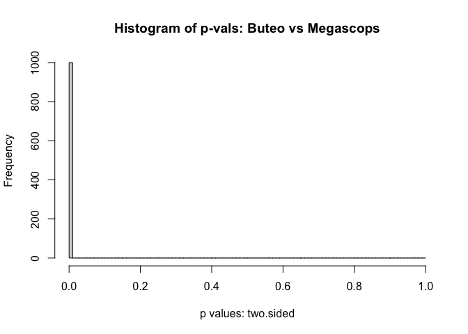<!-- -->

    ## [1] "Performing non-parametric comparison: small, equal sample sizes."
    ## [1] "Conf. Level 0.95. Test is for two.sided"
    ## [1] "Mean for Buteo is 0.4225"
    ## [1] "Mean for Megascops is 0.1948"
    ## [1] "Sampling 200 samples. If too small, skipped."
    ## ================================================================================
    ## [1] "Complete."
    ## [1] "Difference of subsamples has a p value of 1.62367599008204e-34"
    ## [1] "P value has stdev of 5.12928607608743e-33"

<!-- -->

``` r
mann_whitney_compare(sp.a = "Accipiter",sp.b = "Megascops",
                     a = acci_abun,b = mega_abun)
```

    ## [1] "A is larger."
    ## [1] "Performing non-parametric comparison: large samples."
    ## [1] "Conf. Level 0.95. Test is for two.sided"
    ## [1] "Median for Accipiter is 0.337"
    ## [1] "Median for Megascops is 0.1027"
    ## ================================================================================
    ## [1] "Complete."
    ## [1] "Difference has a p value of 3.67228291658874e-74"
    ## [1] "P value has stdev of 7.98387653099291e-73"

<!-- -->

    ## [1] "Performing non-parametric comparison: small, equal sample sizes."
    ## [1] "Conf. Level 0.95. Test is for two.sided"
    ## [1] "Mean for Accipiter is 0.3666"
    ## [1] "Mean for Megascops is 0.1948"
    ## [1] "Sampling 200 samples. If too small, skipped."
    ## ================================================================================
    ## [1] "Complete."
    ## [1] "Difference of subsamples has a p value of 3.50973658169369e-21"
    ## [1] "P value has stdev of 9.70184474672804e-20"

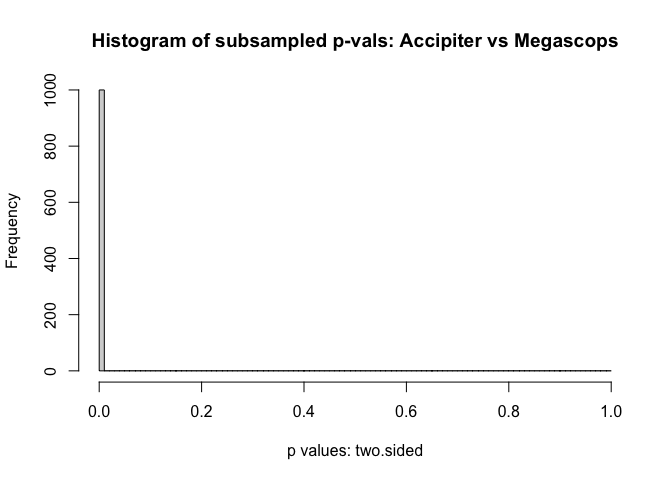<!-- -->

``` r
mann_whitney_compare(sp.a = "Strix",sp.b = "Megascops",
                     a = strx_abun,b = mega_abun)
```

    ## [1] "A is larger."
    ## [1] "Performing non-parametric comparison: large samples."
    ## [1] "Conf. Level 0.95. Test is for two.sided"
    ## [1] "Median for Strix is 0.2083"
    ## [1] "Median for Megascops is 0.1027"
    ## ================================================================================
    ## [1] "Complete."
    ## [1] "Difference has a p value of 1.19219231881083e-09"
    ## [1] "P value has stdev of 1.81838400049367e-08"

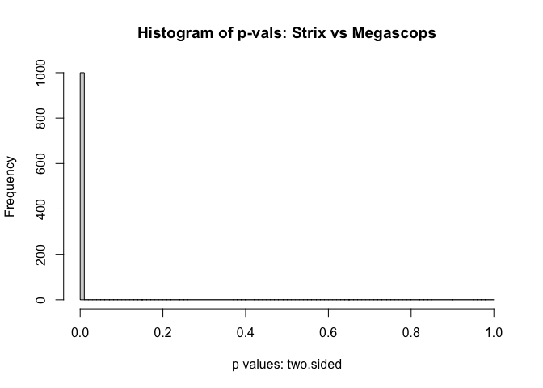<!-- -->

    ## [1] "Performing non-parametric comparison: small, equal sample sizes."
    ## [1] "Conf. Level 0.95. Test is for two.sided"
    ## [1] "Mean for Strix is 0.2264"
    ## [1] "Mean for Megascops is 0.1948"
    ## [1] "Sampling 200 samples. If too small, skipped."
    ## ================================================================================
    ## [1] "Complete."
    ## [1] "Difference of subsamples has a p value of 0.00139130179477204"
    ## [1] "P value has stdev of 0.00710758425942422"

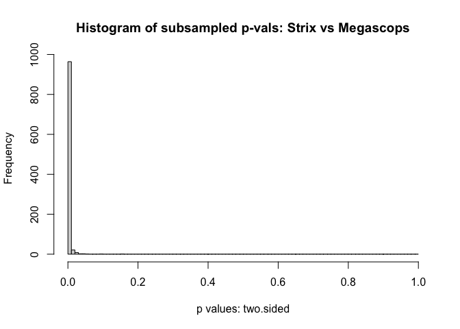<!-- -->

``` r
mann_whitney_compare(sp.a = "Buteo",sp.b = "Accipiter",
                     a = bute_abun,b = acci_abun)
```

    ## [1] "A is larger."
    ## [1] "Performing non-parametric comparison: large samples."
    ## [1] "Conf. Level 0.95. Test is for two.sided"
    ## [1] "Median for Buteo is 0.422"
    ## [1] "Median for Accipiter is 0.337"
    ## ================================================================================
    ## [1] "Complete."
    ## [1] "Difference has a p value of 4.06413637315679e-95"
    ## [1] "P value has stdev of 1.22015255019248e-93"

<!-- -->

    ## [1] "Performing non-parametric comparison: small, equal sample sizes."
    ## [1] "Conf. Level 0.95. Test is for two.sided"
    ## [1] "Mean for Buteo is 0.4225"
    ## [1] "Mean for Accipiter is 0.3666"
    ## [1] "Sampling 200 samples. If too small, skipped."
    ## ================================================================================
    ## [1] "Complete."
    ## [1] "Difference of subsamples has a p value of 0.00158654625798426"
    ## [1] "P value has stdev of 0.0216357728559549"

<!-- -->

``` r
mann_whitney_compare(sp.a = "Buteo",sp.b = "Strix",
                     a = bute_abun,b = strx_abun)
```

    ## [1] "A is larger."
    ## [1] "Performing non-parametric comparison: large samples."
    ## [1] "Conf. Level 0.95. Test is for two.sided"
    ## [1] "Median for Buteo is 0.422"
    ## [1] "Median for Strix is 0.2083"
    ## ================================================================================
    ## [1] "Complete."
    ## [1] "Difference has a p value of 0"
    ## [1] "P value has stdev of 0"

<!-- -->

    ## [1] "Performing non-parametric comparison: small, equal sample sizes."
    ## [1] "Conf. Level 0.95. Test is for two.sided"
    ## [1] "Mean for Buteo is 0.4225"
    ## [1] "Mean for Strix is 0.2264"
    ## [1] "Sampling 200 samples. If too small, skipped."
    ## ================================================================================
    ## [1] "Complete."
    ## [1] "Difference of subsamples has a p value of 1.60854025299611e-30"
    ## [1] "P value has stdev of 5.00554619027054e-29"

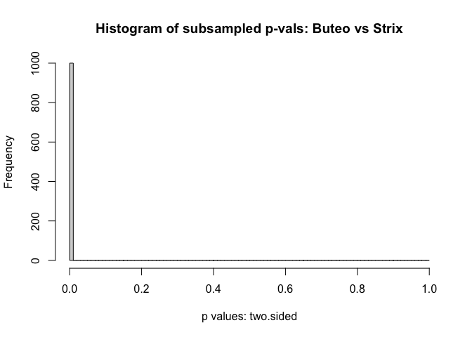<!-- -->

``` r
mann_whitney_compare(sp.a = "Passer",sp.b = "Vociferus",
                     a = pass_abun,b = voci_abun)
```

    ## [1] "A is larger."
    ## [1] "Performing non-parametric comparison: large samples."
    ## [1] "Conf. Level 0.95. Test is for two.sided"
    ## [1] "Median for Passer is 0.1337"
    ## [1] "Median for Vociferus is 0"
    ## ================================================================================
    ## [1] "Complete."
    ## [1] "Difference has a p value of 6.96042142622703e-30"
    ## [1] "P value has stdev of 9.67269584340246e-29"

<!-- -->

    ## [1] "Performing non-parametric comparison: small, equal sample sizes."
    ## [1] "Conf. Level 0.95. Test is for two.sided"
    ## [1] "Mean for Passer is 0.1835"
    ## [1] "Mean for Vociferus is 0.109"
    ## [1] "Sampling 200 samples. If too small, skipped."
    ## ================================================================================
    ## [1] "Complete."
    ## [1] "Difference of subsamples has a p value of 3.25502852711168e-20"
    ## [1] "P value has stdev of 3.78996578166909e-19"

<!-- -->

``` r
mann_whitney_compare(sp.a = "Passer",sp.b = "Carolinensis",
                     a = pass_abun,b = caro_abun)
```

    ## [1] "A is larger."
    ## [1] "Performing non-parametric comparison: large samples."
    ## [1] "Conf. Level 0.95. Test is for two.sided"
    ## [1] "Median for Passer is 0.1337"
    ## [1] "Median for Carolinensis is 0.0219"
    ## ================================================================================
    ## [1] "Complete."
    ## [1] "Difference has a p value of 1.44591918576225e-07"
    ## [1] "P value has stdev of 3.92031645332453e-07"

<!-- -->

    ## [1] "Performing non-parametric comparison: small, equal sample sizes."
    ## [1] "Conf. Level 0.95. Test is for two.sided"
    ## [1] "Mean for Passer is 0.1835"
    ## [1] "Mean for Carolinensis is 0.2203"
    ## [1] "Sampling 200 samples. If too small, skipped."
    ## [1] "Too few points."

``` r
mann_whitney_compare(sp.a = "Chaetura",sp.b = "Vociferus",
                     a = chae_abun,b = voci_abun)
```

    ## [1] "A is larger."
    ## [1] "Performing non-parametric comparison: large samples."
    ## [1] "Conf. Level 0.95. Test is for two.sided"
    ## [1] "Median for Chaetura is 0.1494"
    ## [1] "Median for Vociferus is 0"
    ## ================================================================================
    ## [1] "Complete."
    ## [1] "Difference has a p value of 7.31564013135877e-27"
    ## [1] "P value has stdev of 1.15158151256982e-25"

<!-- -->

    ## [1] "Performing non-parametric comparison: small, equal sample sizes."
    ## [1] "Conf. Level 0.95. Test is for two.sided"
    ## [1] "Mean for Chaetura is 0.2058"
    ## [1] "Mean for Vociferus is 0.109"
    ## [1] "Sampling 200 samples. If too small, skipped."
    ## ================================================================================
    ## [1] "Complete."
    ## [1] "Difference of subsamples has a p value of 1.28939440398404e-18"
    ## [1] "P value has stdev of 2.27923506613487e-17"

<!-- -->

``` r
mann_whitney_compare(sp.a = "Chaetura",sp.b = "Carolinensis",
                     a = chae_abun,b = caro_abun)
```

    ## [1] "A is larger."
    ## [1] "Performing non-parametric comparison: large samples."
    ## [1] "Conf. Level 0.95. Test is for two.sided"
    ## [1] "Median for Chaetura is 0.1494"
    ## [1] "Median for Carolinensis is 0.0219"
    ## ================================================================================
    ## [1] "Complete."
    ## [1] "Difference has a p value of 0.000206362434052866"
    ## [1] "P value has stdev of 0.000662543944901382"

<!-- -->

    ## [1] "Performing non-parametric comparison: small, equal sample sizes."
    ## [1] "Conf. Level 0.95. Test is for two.sided"
    ## [1] "Mean for Chaetura is 0.2058"
    ## [1] "Mean for Carolinensis is 0.2203"
    ## [1] "Sampling 200 samples. If too small, skipped."
    ## [1] "Too few points."

``` r
mann_whitney_compare(sp.a = "Megascops",sp.b = "Vociferus",
                     a = mega_abun,b = voci_abun)
```

    ## [1] "A is larger."
    ## [1] "Performing non-parametric comparison: large samples."
    ## [1] "Conf. Level 0.95. Test is for two.sided"
    ## [1] "Median for Megascops is 0.1027"
    ## [1] "Median for Vociferus is 0"
    ## ================================================================================
    ## [1] "Complete."
    ## [1] "Difference has a p value of 1.12750405818327e-30"
    ## [1] "P value has stdev of 5.4524492141468e-30"

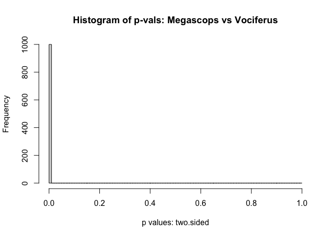<!-- -->

    ## [1] "Performing non-parametric comparison: small, equal sample sizes."
    ## [1] "Conf. Level 0.95. Test is for two.sided"
    ## [1] "Mean for Megascops is 0.1948"
    ## [1] "Mean for Vociferus is 0.109"
    ## [1] "Sampling 200 samples. If too small, skipped."
    ## ================================================================================
    ## [1] "Complete."
    ## [1] "Difference of subsamples has a p value of 2.44147113943014e-20"
    ## [1] "P value has stdev of 4.6002063392319e-19"

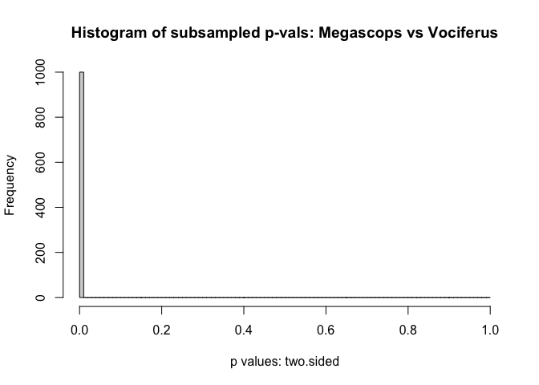<!-- -->

``` r
mann_whitney_compare(sp.a = "Megascops",sp.b = "Carolinensis",
                     a = mega_abun,b = caro_abun)
```

    ## [1] "A is larger."
    ## [1] "Performing non-parametric comparison: large samples."
    ## [1] "Conf. Level 0.95. Test is for two.sided"
    ## [1] "Median for Megascops is 0.1027"
    ## [1] "Median for Carolinensis is 0.0219"
    ## ================================================================================
    ## [1] "Complete."
    ## [1] "Difference has a p value of 2.49749875181617e-05"
    ## [1] "P value has stdev of 6.46392822272726e-05"

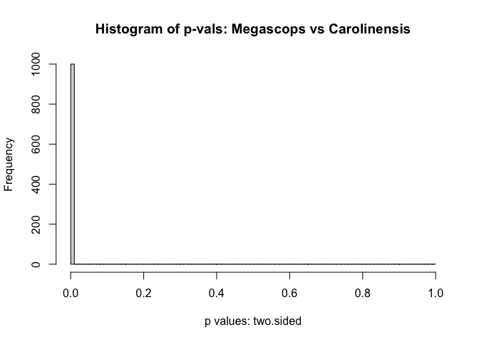<!-- -->

    ## [1] "Performing non-parametric comparison: small, equal sample sizes."
    ## [1] "Conf. Level 0.95. Test is for two.sided"
    ## [1] "Mean for Megascops is 0.1948"
    ## [1] "Mean for Carolinensis is 0.2203"
    ## [1] "Sampling 200 samples. If too small, skipped."
    ## [1] "Too few points."

``` r
mann_whitney_compare(sp.a = "Buteo",sp.b = "Vociferus",
                     a = bute_abun,b = voci_abun)
```

    ## [1] "A is larger."
    ## [1] "Performing non-parametric comparison: large samples."
    ## [1] "Conf. Level 0.95. Test is for two.sided"
    ## [1] "Median for Buteo is 0.422"
    ## [1] "Median for Vociferus is 0"
    ## ================================================================================
    ## [1] "Complete."
    ## [1] "Difference has a p value of 3.20870663972946e-63"
    ## [1] "P value has stdev of 1.82731787834449e-62"

<!-- -->

    ## [1] "Performing non-parametric comparison: small, equal sample sizes."
    ## [1] "Conf. Level 0.95. Test is for two.sided"
    ## [1] "Mean for Buteo is 0.4225"
    ## [1] "Mean for Vociferus is 0.109"
    ## [1] "Sampling 200 samples. If too small, skipped."
    ## ================================================================================
    ## [1] "Complete."
    ## [1] "Difference of subsamples has a p value of 1.53059616794773e-42"
    ## [1] "P value has stdev of 3.31229106140741e-41"

<!-- -->

``` r
mann_whitney_compare(sp.a = "Buteo",sp.b = "Carolinensis",
                     a = bute_abun,b = caro_abun)
```

    ## [1] "A is larger."
    ## [1] "Performing non-parametric comparison: large samples."
    ## [1] "Conf. Level 0.95. Test is for two.sided"
    ## [1] "Median for Buteo is 0.422"
    ## [1] "Median for Carolinensis is 0.0219"
    ## ================================================================================
    ## [1] "Complete."
    ## [1] "Difference has a p value of 7.42318745006301e-14"
    ## [1] "P value has stdev of 2.19036122105703e-14"

<!-- -->

    ## [1] "Performing non-parametric comparison: small, equal sample sizes."
    ## [1] "Conf. Level 0.95. Test is for two.sided"
    ## [1] "Mean for Buteo is 0.4225"
    ## [1] "Mean for Carolinensis is 0.2203"
    ## [1] "Sampling 200 samples. If too small, skipped."
    ## [1] "Too few points."

``` r
mann_whitney_compare(sp.a = "Accipiter",sp.b = "Vociferus",
                     a = acci_abun,b = voci_abun)
```

    ## [1] "A is larger."
    ## [1] "Performing non-parametric comparison: large samples."
    ## [1] "Conf. Level 0.95. Test is for two.sided"
    ## [1] "Median for Accipiter is 0.337"
    ## [1] "Median for Vociferus is 0"
    ## ================================================================================
    ## [1] "Complete."
    ## [1] "Difference has a p value of 1.61313203568628e-52"
    ## [1] "P value has stdev of 2.04867944461559e-51"

<!-- -->

    ## [1] "Performing non-parametric comparison: small, equal sample sizes."
    ## [1] "Conf. Level 0.95. Test is for two.sided"
    ## [1] "Mean for Accipiter is 0.3666"
    ## [1] "Mean for Vociferus is 0.109"
    ## [1] "Sampling 200 samples. If too small, skipped."
    ## ================================================================================
    ## [1] "Complete."
    ## [1] "Difference of subsamples has a p value of 3.72066402044544e-38"
    ## [1] "P value has stdev of 4.1495158824164e-37"

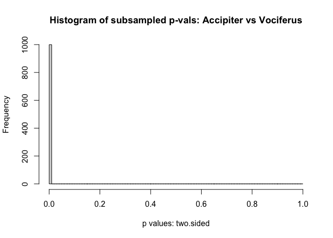<!-- -->

``` r
mann_whitney_compare(sp.a = "Accipiter",sp.b = "Carolinensis",
                     a = acci_abun,b = caro_abun)
```

    ## [1] "A is larger."
    ## [1] "Performing non-parametric comparison: large samples."
    ## [1] "Conf. Level 0.95. Test is for two.sided"
    ## [1] "Median for Accipiter is 0.337"
    ## [1] "Median for Carolinensis is 0.0219"
    ## ================================================================================
    ## [1] "Complete."
    ## [1] "Difference has a p value of 6.03471870222576e-13"
    ## [1] "P value has stdev of 9.53155436818303e-13"

<!-- -->

    ## [1] "Performing non-parametric comparison: small, equal sample sizes."
    ## [1] "Conf. Level 0.95. Test is for two.sided"
    ## [1] "Mean for Accipiter is 0.3666"
    ## [1] "Mean for Carolinensis is 0.2203"
    ## [1] "Sampling 200 samples. If too small, skipped."
    ## [1] "Too few points."

``` r
mann_whitney_compare(sp.a = "Vociferus",sp.b = "Carolinensis",
                     a = voci_abun,b = caro_abun)
```

    ## [1] "A is larger."
    ## [1] "Performing non-parametric comparison: large samples."
    ## [1] "Conf. Level 0.95. Test is for two.sided"
    ## [1] "Median for Vociferus is 0"
    ## [1] "Median for Carolinensis is 0.0219"
    ## ================================================================================
    ## [1] "Complete."
    ## [1] "Difference has a p value of 0.000234744860011999"
    ## [1] "P value has stdev of 0.000853757575363335"

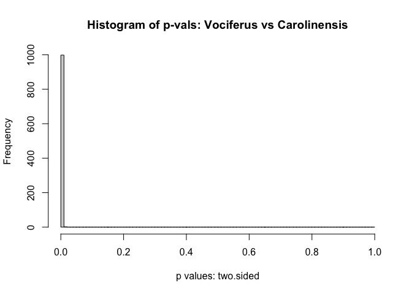<!-- -->

    ## [1] "Performing non-parametric comparison: small, equal sample sizes."
    ## [1] "Conf. Level 0.95. Test is for two.sided"
    ## [1] "Mean for Vociferus is 0.109"
    ## [1] "Mean for Carolinensis is 0.2203"
    ## [1] "Sampling 200 samples. If too small, skipped."
    ## [1] "Too few points."
