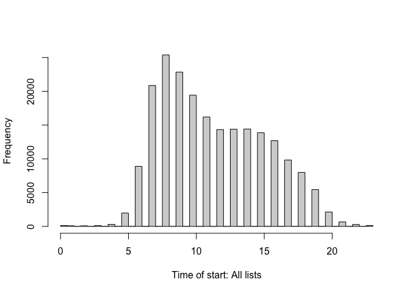
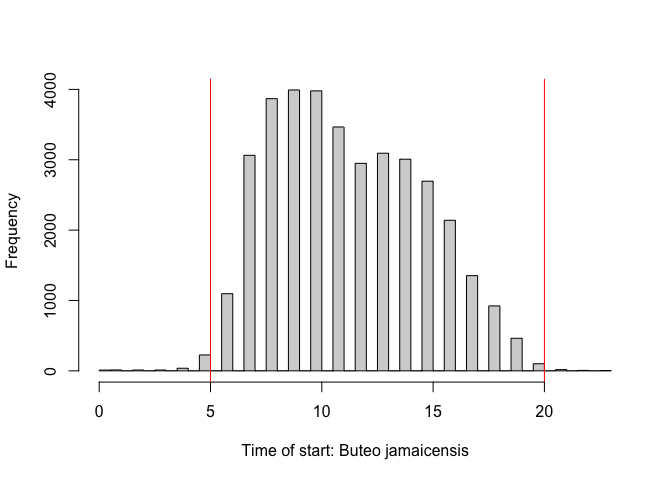
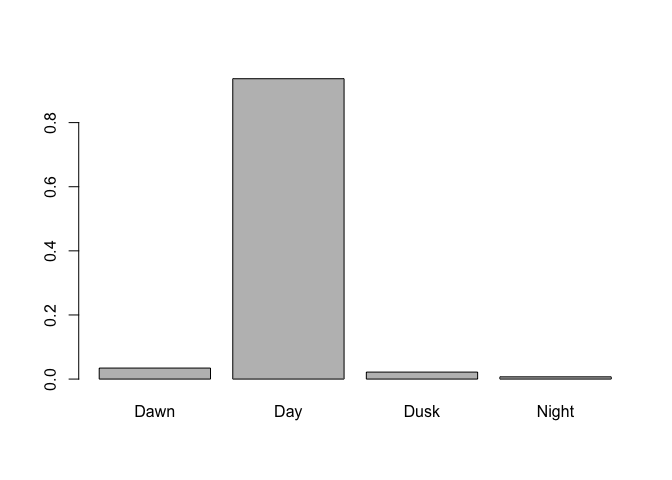
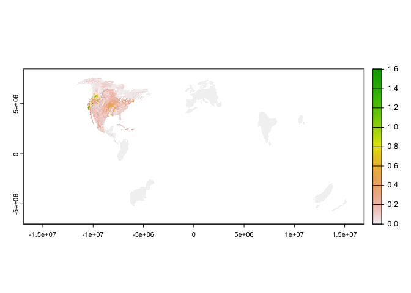
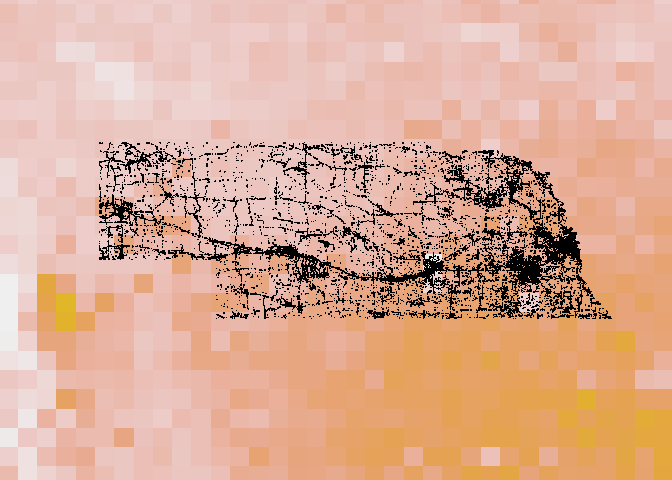
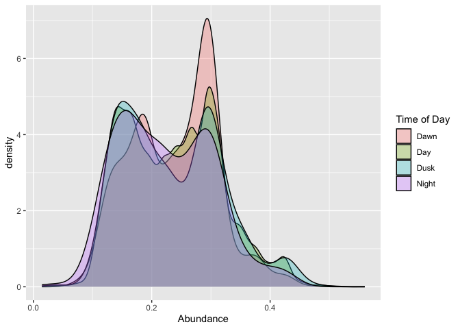
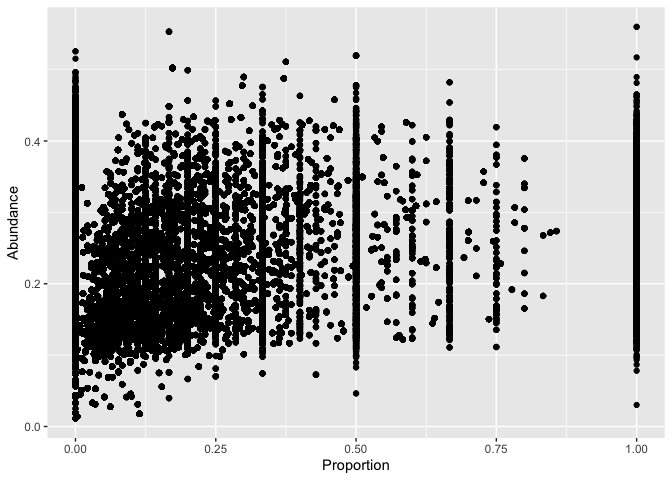
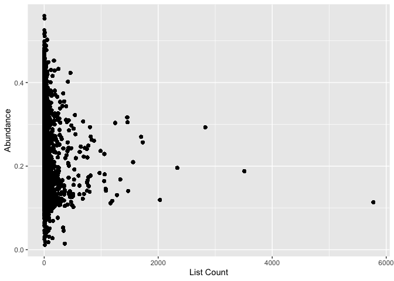

Geographic Extraction
================
Maddie Bengston, Jacob C. Cooper
2024-02-08

``` r
filepath <- "~/OneDrive - University of Nebraska at Kearney/Research/Eastern Screech-Owls/"

library(tidyverse)
```

    ## ── Attaching core tidyverse packages ──────────────────────── tidyverse 2.0.0 ──
    ## ✔ dplyr     1.1.3     ✔ readr     2.1.4
    ## ✔ forcats   1.0.0     ✔ stringr   1.5.0
    ## ✔ ggplot2   3.4.4     ✔ tibble    3.2.1
    ## ✔ lubridate 1.9.3     ✔ tidyr     1.3.0
    ## ✔ purrr     1.0.2     
    ## ── Conflicts ────────────────────────────────────────── tidyverse_conflicts() ──
    ## ✖ dplyr::filter() masks stats::filter()
    ## ✖ dplyr::lag()    masks stats::lag()
    ## ℹ Use the conflicted package (<http://conflicted.r-lib.org/>) to force all conflicts to become errors

``` r
library(terra)
```

    ## terra 1.7.46
    ## 
    ## Attaching package: 'terra'
    ## 
    ## The following object is masked from 'package:tidyr':
    ## 
    ##     extract

``` r
library(auk)
```

    ## auk 0.6.0 is designed for EBD files downloaded after 2022-10-25. 
    ## EBD data directory:  /Users/cooperj2/Library/CloudStorage/OneDrive-UniversityofNebraskaatKearney/Research/Resurvey/Kansas Resurvey/ebd_US-KS_202108_202312_smp_relNov-2023 
    ## eBird taxonomy version:  2022

``` r
library(lutz)
library(suncalc)

# load time function
source(paste0(filepath,"ebird_time_data.R"))
source(paste0(filepath,"ebd_subsetter.R"))
```

``` r
observations <- read_rds(paste0(filepath,"Buteo_jamaicensis.rds"))

summary(observations)
```

    ##  checklist_id       last_edited_date     country          country_code      
    ##  Length:212425      Length:212425      Length:212425      Length:212425     
    ##  Class :character   Class :character   Class :character   Class :character  
    ##  Mode  :character   Mode  :character   Mode  :character   Mode  :character  
    ##                                                                             
    ##                                                                             
    ##                                                                             
    ##                                                                             
    ##     state            state_code           county          county_code       
    ##  Length:212425      Length:212425      Length:212425      Length:212425     
    ##  Class :character   Class :character   Class :character   Class :character  
    ##  Mode  :character   Mode  :character   Mode  :character   Mode  :character  
    ##                                                                             
    ##                                                                             
    ##                                                                             
    ##                                                                             
    ##    iba_code            bcr_code      usfws_code        atlas_block       
    ##  Length:212425      Min.   :11.00   Length:212425      Length:212425     
    ##  Class :character   1st Qu.:19.00   Class :character   Class :character  
    ##  Mode  :character   Median :22.00   Mode  :character   Mode  :character  
    ##                     Mean   :20.05                                        
    ##                     3rd Qu.:22.00                                        
    ##                     Max.   :22.00                                        
    ##                                                                          
    ##    locality         locality_id        locality_type         latitude    
    ##  Length:212425      Length:212425      Length:212425      Min.   :40.00  
    ##  Class :character   Class :character   Class :character   1st Qu.:40.79  
    ##  Mode  :character   Mode  :character   Mode  :character   Median :41.14  
    ##                                                           Mean   :41.23  
    ##                                                           3rd Qu.:41.44  
    ##                                                           Max.   :43.00  
    ##                                                                          
    ##    longitude       observation_date     time_observations_started
    ##  Min.   :-104.05   Min.   :2000-02-13   Length:212425            
    ##  1st Qu.: -99.24   1st Qu.:2017-05-04   Class :character         
    ##  Median : -96.85   Median :2020-04-01   Mode  :character         
    ##  Mean   : -98.03   Mean   :2019-03-18                            
    ##  3rd Qu.: -96.43   3rd Qu.:2022-02-23                            
    ##  Max.   : -95.33   Max.   :2023-08-31                            
    ##                                                                  
    ##  observer_id        sampling_event_identifier protocol_type     
    ##  Length:212425      Length:212425             Length:212425     
    ##  Class :character   Class :character          Class :character  
    ##  Mode  :character   Mode  :character          Mode  :character  
    ##                                                                 
    ##                                                                 
    ##                                                                 
    ##                                                                 
    ##  protocol_code      project_code       duration_minutes effort_distance_km
    ##  Length:212425      Length:212425      Min.   :  1.00   Min.   : 0.000    
    ##  Class :character   Class :character   1st Qu.: 12.00   1st Qu.: 0.000    
    ##  Mode  :character   Mode  :character   Median : 30.00   Median : 0.644    
    ##                                        Mean   : 55.82   Mean   : 2.310    
    ##                                        3rd Qu.: 71.00   3rd Qu.: 2.414    
    ##                                        Max.   :720.00   Max.   :80.467    
    ##                                                                           
    ##  effort_area_ha   number_observers  all_species_reported group_identifier  
    ##  Min.   : 0.00    Min.   :  0.000   Mode:logical         Length:212425     
    ##  1st Qu.: 0.12    1st Qu.:  1.000   TRUE:212425          Class :character  
    ##  Median : 0.12    Median :  1.000                        Mode  :character  
    ##  Mean   : 0.96    Mean   :  1.478                                          
    ##  3rd Qu.: 0.40    3rd Qu.:  1.000                                          
    ##  Max.   :40.47    Max.   :208.000                                          
    ##  NA's   :212299   NA's   :1726                                             
    ##  trip_comments      scientific_name    observation_count species_observed
    ##  Length:212425      Length:212425      Min.   : 0.0000   Mode :logical   
    ##  Class :character   Class :character   1st Qu.: 0.0000   FALSE:175899    
    ##  Mode  :character   Mode  :character   Median : 0.0000   TRUE :36526     
    ##                                        Mean   : 0.2559                   
    ##                                        3rd Qu.: 0.0000                   
    ##                                        Max.   :41.0000                   
    ##                                                                          
    ##            Time_Zone       start_condition     end_condition   
    ##  America/Chicago:185970   Diurnal  :201475   Diurnal  :202733  
    ##  America/Denver : 26455   Nocturnal: 10950   Nocturnal:  9692  
    ##                                                                
    ##                                                                
    ##                                                                
    ##                                                                
    ##                                                                
    ##    Time_Date                      Time_of_Day   
    ##  Min.   :2000-02-13 22:30:00.00   Dawn :  5965  
    ##  1st Qu.:2017-05-04 13:30:00.00   Day  :196768  
    ##  Median :2020-04-01 18:15:00.00   Dusk :  4707  
    ##  Mean   :2019-03-19 16:40:22.51   Night:  4985  
    ##  3rd Qu.:2022-02-23 17:27:00.00                 
    ##  Max.   :2023-09-01 03:38:00.00                 
    ## 

``` r
observations$time_observations_started <- 
  as.POSIXct(observations$time_observations_started, 
             format = "%H:%M:%S")

hist(hour(as.POSIXct(observations$time_observations_started,
                     format = "%H:%M:%S")),
     breaks=48,
     xlab="Time of start: All lists",main="")
```

<!-- -->

``` r
hist(
  hour(
    as.POSIXct(observations$time_observations_started,
                     format = "%H:%M:%S")[
      which(observations$species_observed==T)]),
  breaks=48,
  xlab=paste0("Time of start: ",
              observations$scientific_name[1]),
  main="")

abline(v=5,col="red")
abline(v=20,col="red")
```

<!-- -->

``` r
summary(observations$Time_of_Day)/nrow(observations)
```

    ##       Dawn        Day       Dusk      Night 
    ## 0.02808050 0.92629399 0.02215841 0.02346711

What about for just the records with our bird?

``` r
rtha <- observations %>%
  filter(species_observed==T)

summary(rtha$Time_of_Day)/nrow(rtha)
```

    ##        Dawn         Day        Dusk       Night 
    ## 0.034331709 0.936894267 0.021792696 0.006981328

Dawn = 13.1%, Diurnal = 52.9%, Dusk = 6.1%, Nocturnal = 27.9%.

``` r
barplot(prop.table(table(rtha$Time_of_Day)))
```

<!-- -->

``` r
# let's look at abundance

abundance <- rast(paste0(filepath,"abundances/rethaw_abundance_seasonal_full-year_mean_2021.tif"))

plot(abundance)
```

<!-- -->

``` r
# convert to same coordinate system
abundance <- abundance %>% project("epsg:4326")
```

    ## |---------|---------|---------|---------|=========================================                                          

``` r
plot(observations$longitude,observations$latitude,asp=1,pch=".")
plot(abundance,add=T)
points(observations$longitude,observations$latitude,asp=1,pch=".")
```

<!-- -->

``` r
occ <- observations[,c("longitude","latitude")]

vals <- extract(abundance,occ,cells = T) %>%
  cbind(observations$Time_of_Day,
        observations$species_observed) %>%
  rename('abundance' = 'full_year',
         'time_of_day' = 'observations$Time_of_Day',
         'species_observed' = 'observations$species_observed')
```

``` r
a <- ggplot(vals[which(vals$species_observed==T),],aes(x=abundance,fill=time_of_day))
b <- geom_density(alpha = 0.3)
c <- labs(x = "Abundance",fill = "Time of Day")

a+b+c
```

<!-- -->

We are looking for “high detectability = low survey effort”.
Specifically, we want to look at abundance related to the % checklists
with owls from each site.

``` r
cell_nobird <- vals %>% count(cell) %>%
  rename("nobird" = "n")
cell_bird <- vals[which(vals$species_observed==T),] %>% count(cell) %>%
  rename("bird" = "n")

cell_count <- cell_nobird %>% left_join(cell_bird,by = "cell")

cell_count$bird[which(is.na(cell_count$bird))] <- 0

cell_count$proportion <- cell_count$bird/cell_count$nobird

vals <- vals %>%
  left_join(cell_count,by = "cell")

ggplot(vals,aes(x=proportion,y=abundance)) + 
  geom_point() +
  labs(x = "Proportion",y = "Abundance")
```

<!-- -->

``` r
ggplot(vals,aes(x=nobird,y=abundance)) + 
  geom_point() +
  labs(x = "List Count",y = "Abundance")
```

<!-- -->

``` r
write_rds(vals,path = paste0(filepath,"Buteo_jamaicensis_all.rds"))
```

    ## Warning: The `path` argument of `write_rds()` is deprecated as of readr 1.4.0.
    ## ℹ Please use the `file` argument instead.
    ## This warning is displayed once every 8 hours.
    ## Call `lifecycle::last_lifecycle_warnings()` to see where this warning was
    ## generated.
